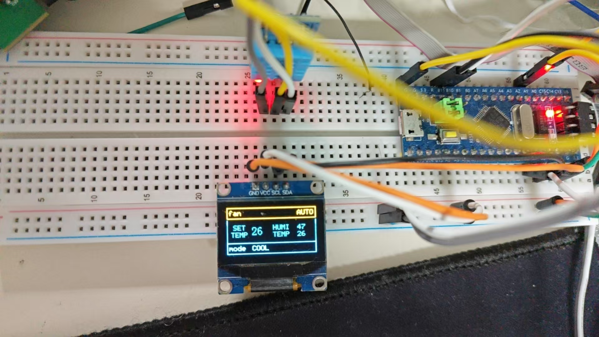

# 使用MXCube生成基于stm32f103c8t6的MDK工程，植入rtthread-nano，finsh组件
不断更新各种驱动组件直到rom或ram用尽

目前使用的外设有：  
通过GPIO模拟I2C通讯的OLED屏幕  
DHT11温湿度传感器  
五个按键  
实现了：简易的空调面板，通过rtthread-nano的软件定时器，创建定时任务获取温湿度值，并显示到OLED上  
移植MultiButton按键驱动，注册五个按键，编写五个按键的回调函数  
BTN1:设定温度值-1，最低为16  
BTN2:设定温度值+1，最高为32  
BTN3:切换风速模式，LOW,MID,HIGH,AUTO  
BTN4:切换温度模式，COLD,SLEEP,APPLY WIND  
BTN5:开关机  
通过软件定时器每五毫秒执行一次按键扫描函数  
